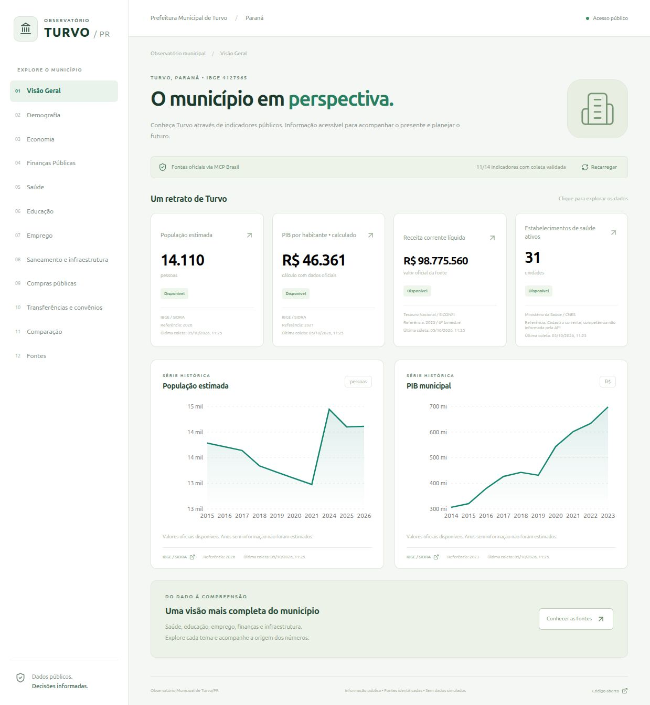

# Observatório Municipal de Turvo/PR

Dashboard público em **pt-BR** para Turvo/PR, código IBGE **4127965**, com indicadores rastreáveis, gráficos, séries históricas, tabelas, comparações e catálogo de fontes. Repositório: https://github.com/Prefeitura-de-Turvo/observatorio-municipal.

## Estado da entrega

Aplicação executável, frontend responsivo, backend, ingestão real via MCP Brasil, cache persistente e atualização programada. **Não existem mocks ou números pré-preenchidos em produção.** O banco começa vazio e só recebe respostas validadas. Fixtures artificiais ficam exclusivamente em testes.

Os 12 módulos estão presentes: Visão Geral, Demografia, Economia, Finanças Públicas, Saúde, Educação, Emprego, Saneamento/Infraestrutura, Compras Públicas/PNCP, Transferências/convênios, Comparação e Fontes. A existência de um módulo não significa que todas as fontes estejam disponíveis.

As coletas reais validaram IBGE, CNES, PNCP, FNDE/PNAE, SICONFI e transferências especiais. Os adaptadores tratam o RREO Simplificado de Turvo, filtros OData FNDE com espaços percent-encoded e HTTP 204/429 no PNCP. Falhas futuras exibem indisponibilidade ou cache preservado, sem zeros artificiais. A tabela de área 1301 retorna referência antiga (2010), indicada no dashboard. RAIS possui importador suplementar de arquivos oficiais; não há API RAIS no MCP inspecionado. IDEB municipal e convênios tradicionais permanecem explicitamente pendentes de integração complementar. Consulte [validação](docs/validacao.md).

## Iniciar em desenvolvimento

Requisitos: Git, Node.js 22, npm e [uv](https://docs.astral.sh/uv/). Python 3.12/3.13; o uv instala a versão compatível automaticamente. Internet é necessária para instalação e coleta, mas o dashboard consulta apenas seu cache local.

```bash
git clone https://github.com/Prefeitura-de-Turvo/observatorio-municipal.git
cd observatorio-municipal
cp .env.example .env
uv sync --locked
npm ci
# Coleta inicial. Falhas individuais não removem dados validados.
uv run python -m backend.ingest
# Terminal 1: API, dashboard compilado e atualização em segundo plano
uv run uvicorn backend.app:app --host 127.0.0.1 --port 8000
# Terminal 2: frontend com recarregamento automático e proxy para a API
npm run dev
```

Frontend de desenvolvimento: `http://localhost:5173`. API/OpenAPI: `http://localhost:8000/docs`. Para servir tudo no mesmo endereço:

```bash
npm run build
uv run uvicorn backend.app:app --host 127.0.0.1 --port 8000 --workers 1
```

O processo da API verifica a necessidade de atualização a cada minuto. A primeira coleta ocorre em segundo plano quando o banco não possui execução recente. `REFRESH_HOURS=24` é o padrão. RREO, PNCP e transferências consultam o último exercício fechado por padrão, com o intervalo explicitamente exibido. Recarregar na interface apenas relê o cache, sem disparar consultas governamentais. A CLI imprime `success`, `partial` ou `already_running`; uma coleta parcial é operacionalmente esperada e deve ser monitorada.

## MCP Brasil: uso real e interfaces

Antes de implementar, foram inspecionados o servidor conectado (`listar_features`, `search_tools`, `call_tool`), seu catálogo e o código-fonte oficial. A versão conectada habilitava 42 features, sem SICONFI. O código revisado e fixado para execução local é [Mcp-Brasil/mcp-brasil@2efb258](https://github.com/Mcp-Brasil/mcp-brasil/tree/2efb258370b125bbf190884283ae10f209b9d335), versão declarada 0.14.0. `uv.lock` fixa também as dependências transitivas.

O backend usa **FastMCP Client → stdio → MCP Brasil**, por meio de `integration/bridge.py`. As ferramentas `observatorio_*` são **extensões deste projeto**, não interfaces oficiais fictícias. O servidor original continua disponível; as extensões reaproveitam seus clientes, schemas, URLs, configuração HTTP e lifecycle. O modo de busca é desabilitado no sidecar (`MCP_BRASIL_TOOL_SEARCH=none`) para expor os schemas completos ao cliente de ingestão.

As extensões estruturadas são necessárias porque as ferramentas orientadas a texto eliminam períodos no IBGE, truncam tabelas fiscais e alguns resumos CNES não aplicam filtros municipais a todos os componentes. Para IBGE e correções de paginação/HTTP 204, a extensão usa o cliente HTTP compartilhado do MCP Brasil com endpoints de suas constantes. Os detalhes estão em [inspeção MCP](docs/mcp-brasil.md).

Modo HTTP opcional, para rede privada:

```bash
MCP_BRIDGE_HTTP=1 uv run python integration/bridge.py
# Em .env: MCP_TRANSPORT=http e MCP_URL=http://127.0.0.1:8001/mcp
```

O backend HTTP exige as extensões locais `observatorio_*`. Apontar ao MCP padrão sem elas resulta em indisponibilidade explícita. Não exponha o sidecar diretamente ao público; ele disponibiliza ferramentas governamentais e pode ampliar consumo de APIs. Use rede privada/autenticação em infraestrutura separada. `MCP_TOKEN` é enviado somente pelo backend.

## Catálogo e rastreabilidade

Cada indicador contém fonte, endpoint/parâmetros quando disponíveis, método, unidade, período de referência, data da última **coleta bem-sucedida** e estado:

- `available`: resposta validada dentro do intervalo de atualização;
- `stale`: último dado real preservado, coleta recente falhou ou TTL expirou;
- `unavailable`: ainda não há resposta publicável;
- `pending`: integração complementar não homologada.

`null`, dados suprimidos, HTTP 4xx/5xx e ausência de registros estatísticos não viram zero. Cadastros só publicam zero após uma resposta vazia válida e paginação completa. Valores financeiros estimados, planos de ação e contratos não são gastos pagos. PIB por habitante é um **cálculo** com PIB/população no mesmo ano, distinto da série oficial de PIB per capita.

O SQLite conserva cache, respostas de evidência e registros de execuções. `sources/` do projeto ChatGPT não é utilizado nem alterado. Consulte [catálogo inicial](docs/indicadores.md) e [arquitetura](docs/arquitetura.md).

## API pública

| Endpoint | Resultado |
|---|---|
| `GET /api/indicators` | Catálogo com valores, séries, registros e proveniência |
| `GET /api/sources` | Fontes e metadados do catálogo |
| `GET /api/comparison` | Municípios do Paraná mais próximos em população no mesmo ano |
| `GET /api/export/{id}` | Série em CSV pt-BR, com fonte, período e coleta |
| `GET /api/health` | Disponibilidade do processo e estado da última execução |

A API é somente leitura. Não aceita ferramentas arbitrárias nem atualizações por visitantes. Os CSVs de séries numéricas possuem BOM UTF-8 e delimitador `;`. Cadastros detalhados estão na API JSON e nas tabelas; não são exportados como se fossem séries numéricas.

## Operação e deploy

```bash
cp .env.example .env
docker compose up --build -d
```

A porta do Compose é vinculada a `127.0.0.1:8000`. Configure proxy reverso e HTTPS para publicar no domínio escolhido, por exemplo `observatorio.turvo.pr.gov.br` **somente após provisionar esse domínio**. Nenhum domínio foi presumido ou publicado automaticamente. O volume `observatorio-data` deve ser persistente e ter backup. Um worker é suficiente; para múltiplas réplicas, migrar cache/locks para PostgreSQL e separar o job de coleta. Veja [deploy e operação](docs/deploy.md).

Os templates em `docs/github-actions/` permitem executar testes em push/PR e coleta diária às **06:30 em America/Sao_Paulo**, além da execução manual, quando ativados. **Ativação pendente:** a credencial GitHub disponível não possui escopo `workflow`; por isso os YAMLs foram publicados como templates, sem automações GitHub ativas. Para ativar, mover/copiar os templates para `.github/workflows/` usando credencial com permissão para workflows. O banco resultante é um artefato de 30 dias; **o workflow não atualiza automaticamente o servidor publicado**. A coleta em produção é feita pelo agendador interno. O workflow sinaliza falha quando a coleta é parcial, preservando o banco como artefato para auditoria.

## RAIS: importação suplementar

Não se declara uma API inexistente. Obtenha os microdados oficiais da RAIS no Ministério do Trabalho, confirme ano, município, encoding e integridade, e execute:

```bash
uv run python -m backend.import_rais /caminho/arquivo-oficial.txt \
  --year ANO \
  --source-url URL_GOVERNAMENTAL_OFICIAL \
  --sha256 SHA256_CONFERIDO
```

O layout homologado exige `Município` e `Vínculo Ativo 31/12` (`0`/`1`), delimitador `;` e encoding latin-1 por padrão. O importador conta apenas vínculos ativos do município do estabelecimento (412796/4127965), valida o hash e preserva proveniência, publicando **somente o agregado**. Não envia nem armazena microdados pessoais no cache. Hash atesta integridade; o operador deve conferir autenticidade e o ano da fonte. Sem arquivo real validado, o módulo permanece pendente. Novos layouts exigem atualização explícita do parser.

## Verificação

```bash
npm run build
uv run pytest -q
uv run ruff check backend integration tests
# Coleta seletiva para investigar uma fonte
uv run python -m backend.ingest population sewage
uv run python -m backend.ingest procurement comparison
```

Testes cobrem território errado, classificação ambígua, ausência de dados, valores suprimidos, conversão de unidade, paginação incompleta, preservação de cache após falha, CSV/API e filtragem RAIS. Para auditoria de coleta, consultar `runs.detail` e `evidence` no banco local, mantendo logs privados.

## Evolução prevista

1. Homologar download e processamento municipal de IDEB por rede/etapa, sem substituir pelo indicador estadual.
2. Integrar convênios tradicionais por dados oficiais do TransfereGov, separados das transferências especiais.
3. Homologar cobertura RAIS/Caged automatizada e séries adicionais de saúde, finanças e saneamento.
4. Ampliar comparações com PIB, estrutura etária e outros critérios no mesmo período.

Código sob licença MIT. Os dados mantêm os termos das respectivas fontes; confira [SOURCES.md do MCP Brasil](https://github.com/Mcp-Brasil/mcp-brasil/blob/2efb258370b125bbf190884283ae10f209b9d335/SOURCES.md).

## Prévia


