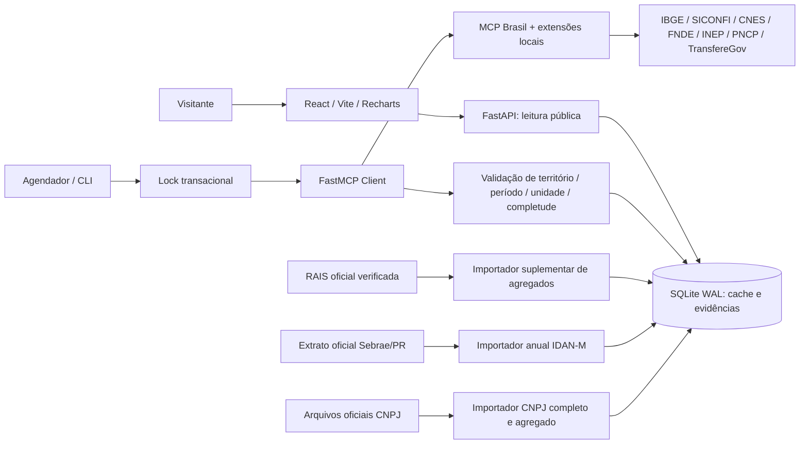

# Arquitetura

## Componentes e decisões

Frontend React 19/TypeScript com navegação por tema, cards, séries e gráficos Recharts, tabelas pesquisáveis/paginadas, modal de metodologia e exportação de séries. Não consulta APIs governamentais no navegador. Fontes, estilos e assets são locais; sem dependência de fontes externas. Layout responsivo com menu móvel, foco visível e preferência de movimento reduzido.

FastAPI serve a API somente leitura e o build do frontend. O ciclo da aplicação cria uma tarefa assíncrona de coleta; consultas públicas seguem disponíveis durante ingestão. Respostas possuem headers de segurança e cache HTTP de 60 segundos. Não há endpoint público de atualização, URL proxy livre ou execução de ferramenta arbitrária.

SQLite em WAL armazena: `cache` por indicador; `evidence` por coleta bem-sucedida; `runs` por execução; `locks` para evitar jobs concorrentes. Um lock de duas horas expira em caso de encerramento abrupto. Gravação de cache e evidência é atômica. Falhas atualizam tentativa/erro, preservando payload e data da última coleta bem-sucedida. Falhas de uma fonte não impedem as demais.

MCP Brasil é executado como sidecar stdio no mesmo ambiente Python fixado por `uv.lock`. Esse isolamento mantém ferramentas e credenciais fora do frontend. HTTP privado é uma alternativa para separar serviços. As extensões usam clientes do MCP Brasil e preservam dados que os formatadores textuais descartam. O checksum/revisão do código-fonte do fornecedor aparece no catálogo da API.

## Ingestão

IBGE mantém JSON de origem, variável, classificação, município, unidade, períodos e URL. Variações monetárias são nominais; sem deflacionamento implícito. Séries não interpolam períodos faltantes. PIB por habitante usa apenas a interseção de anos do PIB municipal e estimativas populacionais.

CNES faz paginação de 20 estabelecimentos por página e confere todos os códigos municipais antes de contar identificadores únicos. Sem extrapolar a primeira página. Competência desconhecida permanece desconhecida. Profissionais descontinuados e leitos potencialmente nacionais não são publicados.

PNCP trata HTTP 204 como ausência legítima de registros, valida o schema da resposta 200, pagina com `totalPaginas`/`totalRegistros`, confere CNPJ e `unidadeOrgao.codigoIbge`, deduplica `numeroControlePNCP` e consulta todas as modalidades 1–14. Contratos são consultados em rota separada para permitir o retrato do Escritório de Compras Públicas. A resposta guardada remove CNPJ/CPF e nomes de fornecedores; gráficos agrupam por categoria e tipo de pessoa, sem afirmar porte empresarial.

TransfereGov pagina e filtra CNPJ e UF; não atribui emendas de Turvo/SC a Turvo/PR. A contagem é de planos de transferências especiais. O endpoint público de Gestão de Parcerias também filtra propostas pelo código IBGE; proposta, convênio firmado e pagamento são conceitos separados. INEP publica resultados IDEB municipais em planilhas oficiais, processadas por etapa/rede sem calcular média entre estratos. FNDE expõe registros por etapa/esfera sem soma potencialmente duplicada. SICONFI exige linha e coluna únicas para RCL e não soma todos os valores monetários da declaração.

O módulo Escritório de Compras Públicas combina contratos PNCP, perfil agregado de estabelecimentos (porte MEI/ME/EPP e CNAE) e a série anual oficial do IDAN-M. O importador CNPJ trabalha fora do ciclo MCP porque exige o conjunto nacional mensal, confere código municipal 412796/PR e grava apenas agregados. Nenhum perfil é publicado a partir de partes da base. O IDAN-M é acompanhado pelo Sebrae/PR, mas não foi localizada tabela/API aberta com a série de Turvo; o importador oficial exige origem Sebrae, hash e código IBGE exato antes de publicar a pontuação anual. A busca pública filtra texto, período de referência e situação da coleta.

## Limites operacionais

A versão inicial opera em uma instância com disco persistente. Para escala, trocar SQLite/locks por PostgreSQL, agendador por worker dedicado e acrescentar Redis para respostas derivadas; o modelo de proveniência permanece. Evidências não têm remoção automática: estabelecer política de retenção e backup em produção. Índices públicos nunca devem conter microdados pessoais. RAIS mantém apenas resultado agregado e hash de entrada.
